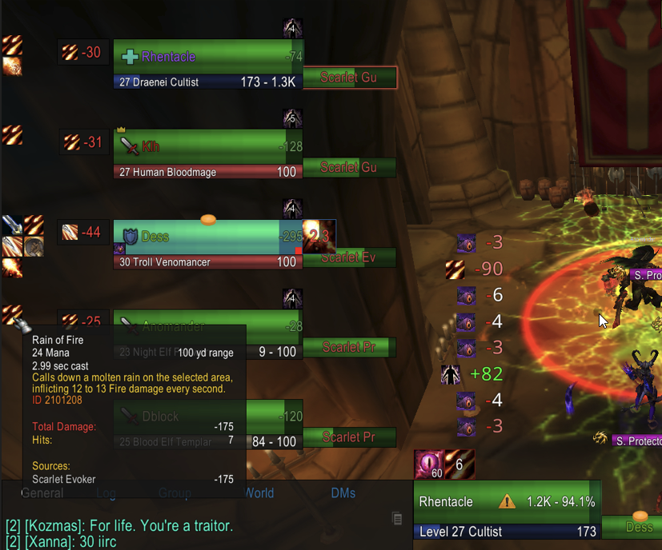
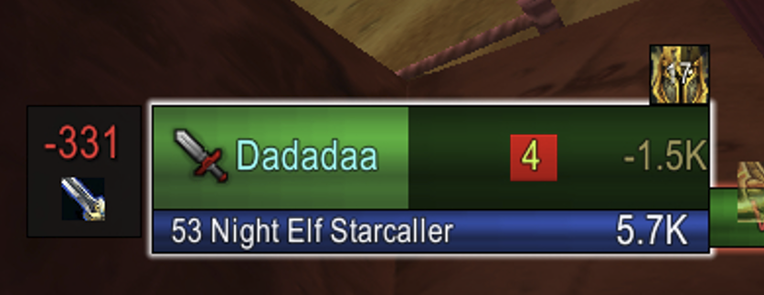
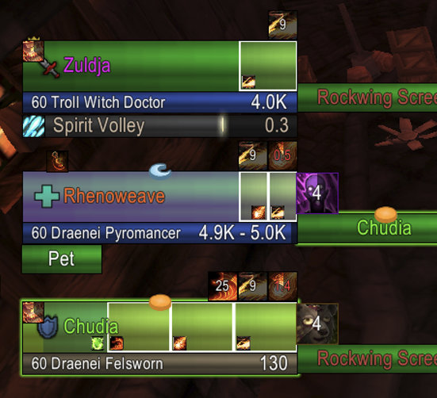
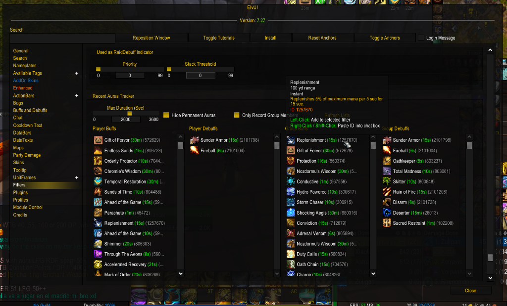
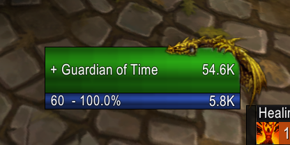
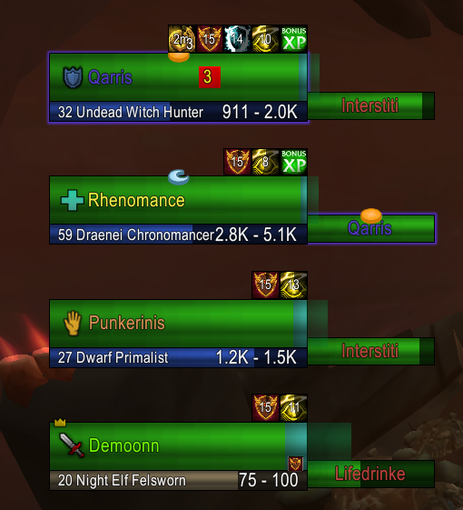
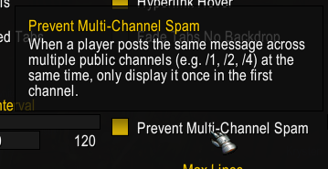

# ElvUI for Ascension (Rhenyra Edition)

Custom ElvUI version optimized for **Ascension.gg (Classless / Conquest of Azeroth)** featuring heavy performance optimizations, custom skinning bugfixes, new modules, and Ascension-specific support.

---

## 🚀 Key Features & Performance Improvements

- **Party Damage Module (Built from Scratch)** - Built from scratch for party frames to track incoming combat log damage in real time. Displays active damage icons next to unit frames with detailed spell tooltips, total damage taken, hit counts, and source breakdowns.
  
  

- **Customizable ThreatIndicator** - Custom threat and mob aggro display for unit frames (Party, Raid, Target, Player) that shows the **exact count of mobs currently targeting the player**, along with dynamic threat glow borders and customizable threat state thresholds. *(Location: `UnitFrames` ➔ `[Select Unit]` ➔ `ThreatIndicator`)*

  

- **New Absorb Shields Engine** - Redesigned shared absorb detection engine for unit frames & nameplates with whitelist-first filtering, 96% reduction in API calls, raid combat throttling, and native absorb API trust mode.

  

- **Recent Auras Tracker** - Track recently applied buffs/debuffs in Filters to easily left-click add them to custom filters with visual status colors (green/red/yellow). *(Location: `Filters` ➔ `Recent Auras`)*

  

- **Target Frame Rare/Elite Overlay** - Added customizable classic/modern/blurry/tiny Rare/Elite frame overlays and profile settings for Target frames. *(Location: `UnitFrames` ➔ `Target Frame` ➔ `Rare/Elite`)*

  

- **CoA Support Spec Detection & RDF Roles** - Automatic background spec inspector detects Ascension support specs (Grovekeeper, Fleshweaver, Wind, etc.) and assigns Support role icons in group frames and RDF.

  

- **Customizable Loot Roll Window & Live Preview** - Configurable width, height, font family, font size, font outline, backdrop transparency, and background color for Loot Roll frames, featuring a built-in `"Preview Loot Roll"` button in options. *(Location: `General` ➔ `Loot Roll Options`)*

- **Unit Frame & Pet Power Bar Custom Color** - Added dedicated Custom Color toggle and RGB color picker for Power bars on Pet and Unit Frames to customize power bar colors independently. *(Location: `UnitFrames` ➔ `Pet` / `[Unit]` ➔ `Power` ➔ `Custom Color`)*

- **Cross-Channel Spam Filter & Fast URL Detection** - Smart cross-channel message deduplication blocks duplicate spam across channels, while URL detection exits instantly unless links (`://`, `www.`, `@`) are detected.

  

- **17 Full Audit Performance Optimizations** - Fixed major raid-scale bottlenecks (e.g. range fader logic bug saving 8,800+ API calls/sec in 40-man raids, lazy chat deduplication, bag item refresh deferral, status tag cache wipes, and 30fps caps on animations/timers).

- **99.8% Reduction in Chat History CPU Overhead** - Optimized `SaveChatHistory` by filtering background channel traffic and deferring name rendering, cutting CPU time from 50.5s down to 0.069s.

- **Customizable Range Fader** - Added custom spell inputs and distance presets for friendly/enemy/resurrect/pet range checks to accommodate CoA classless spell ranges. *(Location: `UnitFrames` ➔ `General Options` ➔ `Range Fader`)*

- **Stable Group Role Sorting** - Replaced unstable API hooks with a deterministic namelist sorter (`TANK`, `HEALER`, `DAMAGER`, `SUPPORT`), eliminating mid-combat frame swapping. *(Location: `UnitFrames` ➔ `Party` / `Raid` ➔ `Set Group by Role`)*

- **ElvUI DTBars2 Module** - Custom datatext bars module allowing creation of additional custom datatext panels positioned anywhere on screen.

- **Customizable ElvUI Loot Frame** - Fully configurable width, font family, font size, icon size, and background/border transparency with live update support. *(Location: `General` ➔ `Loot Frame`)*

- **Ascension Spellbook Range Scanner** - Automatically scans player spellbook for Ascension/Classless spells to populate range-check tables without manual entry.

- **Built-in Quest Announce Module** - Added customizable Quest Announcement system with progress frequency and debug settings. *(Location: `General` ➔ `Quest Announce`)*

- **`/eperf` Performance Profiler Suite** - Added built-in performance profiler command (`/eperf start` / `/eperf stop`) measuring wall-clock time, Lua memory GC churn, FPS, and event storms.

---

## 🛠️ Bug Fixes & Refinements

- **Spellbook Professions Tooltip Fix**: Fixed profession tooltips covering the unlearn/abandon "X" button when hovering over professions in the spellbook by anchoring tooltips cleanly below the profession cards.
- **Toolkit & Skinning Crash Fix**: Resolved `Toolkit.lua` nil arithmetic error in `SetOutside`/`SetInside` when skinning elements before `E.Border` populates.
- **Chat & Tab Position Fixes**: Fixed world channel messages not showing in non-General chat tabs and fixed "Above Chat" positioning blocking chat tab clicks.
- **Party Damage Overlay Fix**: Fixed lingering Party Damage icons by correcting frame map reset order, adding visibility poller hide branches, and parenting overlays to unit frames.
- **Loot Roll Optimization & Class Colors**: Fast-path exit when no rolls active and improved raid/party member class color identification for cross-realm/distant players.
- **World Map Taint & Tooltip Fix**: Fixed map size button re-anchoring taints (`SetPoint = E.noop`) and resolved stuck POI tooltips (`RawHook`).
- **Bag Sorter `nil` `bagFamily` Fix**: Fixed `SharedXML bit.lua` band error caused by custom bags returning nil free slots on Ascension.
- **Unit Frame Safety Guards**: Added nil-checks preventing errors when unit power, castbar text, or name settings are uninitialized.
- **Merchant Buyback Skin Fix**: Properly restores slot border and text colors when buyback slots are cleared.
- **Taint Log Debug Toggle**: Allows `ADDON_ACTION_FORBIDDEN` popup visibility when `taintLog` debug mode is enabled. *(Location: `General` ➔ `Log Taint Errors`)*